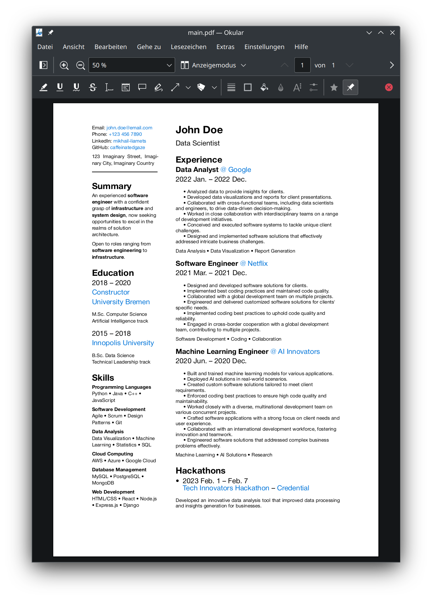

# Bare-bones Typst CV



To generate `main.pdf` and watch for live changes, run:
```bash
make watch
```

To publish `main.pdf` to the server, run:
```bash
make release OUTPUT=dmitrii_kochetov_en1.pdf
```
